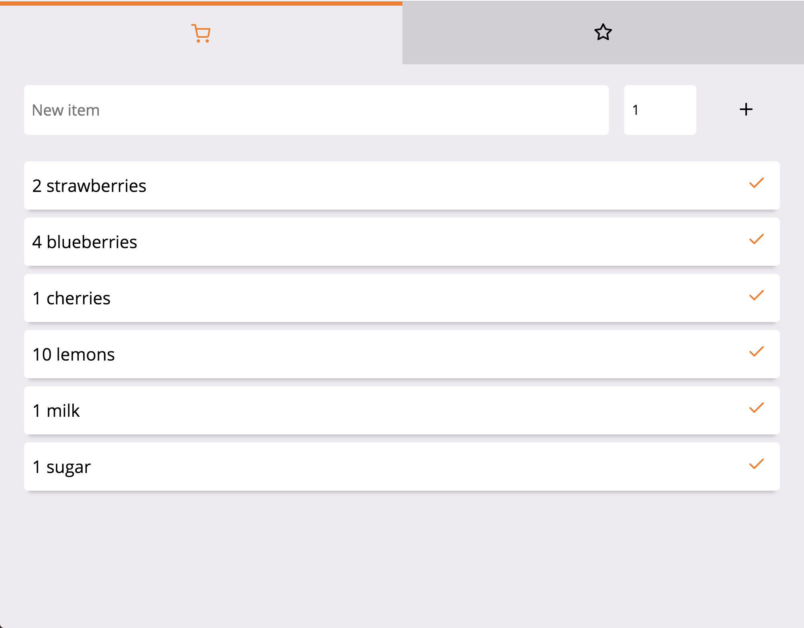

# Grocery Basket



This _Basket_ app allows you to add items and associated quantities to a shopping list. Once you put an item in your basket, you can check it off. Doing that will clear the item from the list.

There is also a recommendations list. Things that are usually purchased, but aren't on your shopping list, appear here. You can add whichever items you like to your shopping list, or delete it from your recommendations.


## Installation

Clone the app and cd into the directory.

```
git clone git@github.com:SarahYiskah/basket.git
cd basket
```

Run

```
npm install && npm start
```
That's it! The app should be up and running on http://localhost:3000/.

## Credits

Creating a React app from scratch (without using `create-react-app`) was something new for me. This [Blogpost](https://blog.usejournal.com/creating-a-react-app-from-scratch-f3c693b84658) made it a breeze.

This [Blogpost](https://medium.freecodecamp.org/part-1-react-app-from-scratch-using-webpack-4-562b1d231e75) was very helpful for getting the CSS to work with my app.
